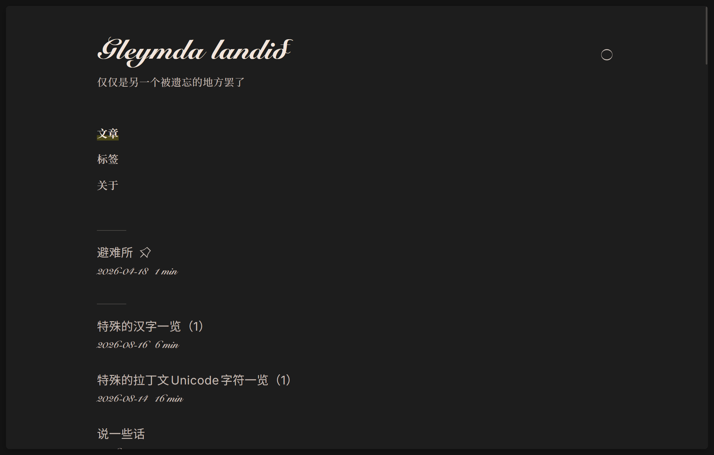

最近从之前使用的[重新编排](https://retypeset.radishzz.cc)主题迁移至了[Firefly](https://firefly.cuteleaf.cn)主题。

之所以进行迁移，是因为之前使用的博客主题存在一些问题。

## 暗色模式切换问题
使用重新编排主题后，我发现这个主题的自动切换暗色模式功能非常容易坏：这个暗色模式切换按钮没有自动切换暗色模式的选项，并且第一次切换暗色之后再访问就不会自动切换了，只有再重新手动开关一下系统暗色模式才会触发自动切换。

然而在我寻找其他主题的过程中，我发现这是一个大多数主题都存在的问题：在这些候选主题中，[Mizuki](http://mizuki.mysqil.com)不支持暗色模式自动切换；[Antfustyle](https://github.com/lin-stephanie/astro-antfustyle-theme)主题、[astro-paper](https://astro-paper.pages.dev)主题和重新编排有同样的问题；只有[Twilight](https://twilight.spr-aachen.com)和[Firefly](https://firefly.cuteleaf.cn)提供了自动切换选项，并且能正常运作。

## 