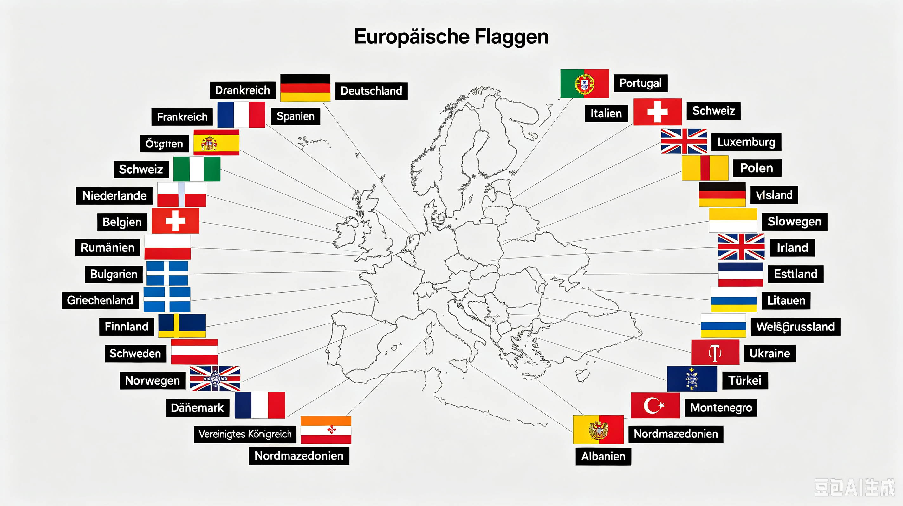

在2022年ChatGPT推出之后，生成式人工智能飞速发展，并且在现实中得到了越来越广泛的应用，从之前的仅文本对话，到现在的支持网络搜索，以及处理文本、音频等多模态功能。这些功能拥有极大提高了信息处理与生成的便捷程度，但是在这众多技术中，我一直觉得有的AI技术是鸡肋的存在，这个技术就是AI生图/生视频。

在我现在重新看这两个技术和它们带来的影响时，我感觉这两个技术不仅是鸡肋，更是**“金玉其外，败絮其中”**。我会从几个这个功能的负面影响解释我的看法。

## 准确性
2025年8月27日，[英国阴道博物馆](https://www.vaginamuseum.co.uk)的Mastodon官方账号[转发了一个截图](https://masto.ai/@vagina_museum/115100134755954006)，截图中展示了一个ChatGPT生成的怀孕示意图的失败案例：

而目前AI生成的图片几乎很难做到准确。比如，我让豆包生成这么一张图片：

> 请生成一张欧洲各国国旗的示意图，并标注德语名称

得到的结果是这样的：

可以看出，这张图片上国旗、对应区域几乎全部错误，虽然大多数德语名称是正确的，但对应基本都错了。

## 娱乐性